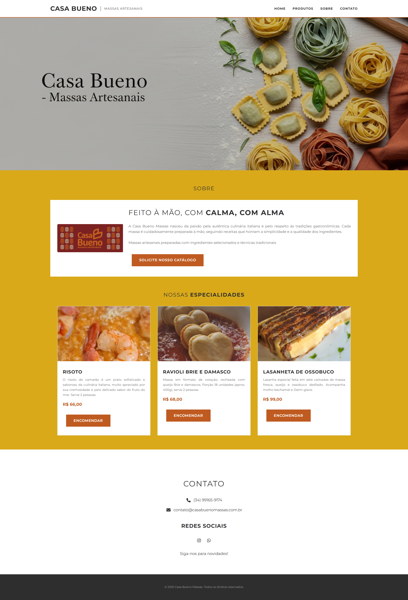

#  Casa Bueno – Massas Artesanais

Site institucional desenvolvido para a Casa Bueno, uma marca especializada em massas artesanais feitas com ingredientes frescos, cuidado e tradição.

##  Visão Geral

O site foi criado com o objetivo de apresentar os produtos da Casa Bueno, transmitir os valores da marca e facilitar o contato com clientes interessados em encomendas ou eventos.

## Tecnologias Utilizadas

- **HTML5** – Estrutura semântica e acessível
- **CSS3** – Estilização personalizada com base na identidade visual da marca
- **JavaScript** – Funcionalidades interativas (como formulário e botões de contato)

##  Paleta de Cores

As cores utilizadas seguem a identidade visual da marca, transmitindo sofisticação e aconchego:

- Vinho Escuro: `#732027`
- Amarelo Mostarda: `#D9A91A`
- Bege Claro: `#D9CAAD`
- Laranja Queimado: `#D9851E`
- Terracota: `#BF5B21`

##  Funcionalidades

- Seção **Hero** com imagem de destaque e chamada principal
- Informações sobre a história e propósito da Casa Bueno
- Galeria ou cardápio com massas artesanais
- Botão de contato via WhatsApp
- Página leve, elegante e fácil de navegar

  

##  Layout Responsivo

O site foi projetado com foco na boa experiência de navegação em celulares, tablets e desktops.  
⚠️ **Observação:** o layout ainda está em fase de ajustes para responsividade total. Algumas seções precisam de adaptações para garantir melhor visualização em diferentes tamanhos de tela.  
Atualizações serão feitas nas próximas versões do projeto.

 

Desenvolvido com carinho por Cláudia Costa Paniago 💛

